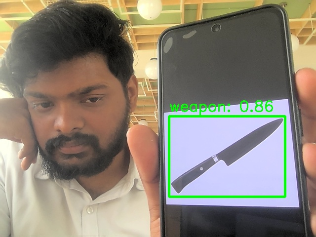
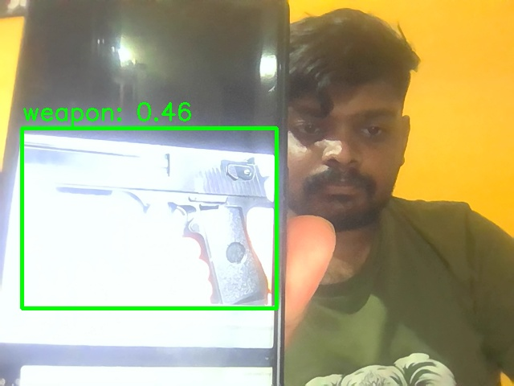

# Violence-Weapon-Detection
 AI-based surveillance system aimed at enhancing public safety through real-time detection  of violent actions and weapons

---
# 🛡️ Violence and Weapon Detection System

**An AI-based surveillance system aimed at enhancing public safety through real-time detection of violent actions and weapons.**  
This repository demonstrates the structure and logic behind a deep learning–powered monitoring system using YOLOv8, OpenCV, and Flask.

---

## 🚀 Overview
The project integrates computer vision, deep learning, and user interface components to build an intelligent surveillance system.  
It detects potential violent behavior and weapon presence in video streams and provides modular code for UI, detection, and backend integration.

This repository is meant as a **technical demonstration** — showcasing structure, modular design, and AI logic — not a fully deployable product.

---

## ⚙️ Tech Stack
- **Language:** Python  
- **Libraries:** OpenCV, YOLOv8 (Ultralytics), Flask, NumPy, PyQt5  
- **Database:** SQLite (`users.db`)  
- **Threading:** ThreadPoolExecutor for parallel frame processing  
- **Cloud Integration:** Google Drive upload logic (demo)  

---

## 🧩 Key Features
- 🔫 **Weapon Detection** — identifies weapon-like objects (e.g., guns, knives).  
- 🥊 **Violence Detection** — frame-level analysis to flag aggressive actions.  
- 👥 **Login & Registration System** — user access control via SQLite.  
- ☁️ **Cloud Upload Option** — backs up detection logs or frames to Drive.  
- 🌐 **Flask Integration** — backend for real-time stream display.  

---
```
📁 Project Structure

├── .gitignore
├── LICENSE
├── README.md
├── database.py # Handles SQLite operations
├── detection.py # YOLOv8 detection logic
├── detection_window.py # GUI logic for detection interface
├── detection_window.ui # PyQt UI file for detection
├── drive_upload.py # Logic for Drive uploads (demo)
├── flask_server.py # Flask backend integration
├── login_window.py # Login GUI logic
├── login_window.ui # Login interface
├── main.py # Application entry point
├── register_window.py # Registration GUI
├── register_window.ui # Registration interface
├── settings_window.py # Settings window logic
├── settings_window.ui # Settings interface
├── user_session.py # Handles session tracking
└── users.db # SQLite database (demo)
```
## 🧠 How It Works (Demo Overview)

This repository is a **code demonstration** of the Violence and Weapon Detection System.  
It provides insight into how such systems are designed, structured, and integrated.

Because model weights and certain datasets are confidential, the project cannot be executed fully as-is.  
The included code illustrates how each component interacts within the system:

- **`detection.py`** → core YOLOv8 detection and frame processing logic  
- **`flask_server.py`** → example backend server for web streaming  
- **`database.py`** → SQLite database operations for user accounts  
- **`login_window.py` & `register_window.py`** → PyQt-based GUI logic  
- **`drive_upload.py`** → cloud backup demo  

This version focuses on **project design and modular architecture**, not on deployability.

---

## 🖼️ Sample Outputs

Below are example results (public demo only):

| Frame Example 1 | Frame Example 2 | Output Video |
|-----------------|-----------------|-------------------|
|  |  | 
|


---

## ⚠️ Notes
- No proprietary datasets, trained weights, or confidential files are included.  
- This code is provided for educational and demonstration purposes.  
- To make it runnable, you’d need to integrate your own YOLO model weights and environment setup.  

---

## 📜 License
This project is licensed under the **MIT License** — see the [LICENSE](LICENSE) file for details.

---

## 👥 Contributors
- [Sanath G](https://github.com/Sanath-G)  
- [Sanketh G](https://github.com/sanketh-g)
- [P Sowgandhika](https://github.com/Sowgandhika-Reddy)  

---

## 📧 Contact
For queries or collaboration:
> - [23g.sanath@gmail.com](mailto:23g.sanath@gmail.com)
> - [g.sanketh23@gmail.com](mailto:g.23sanketh@gmail.com)
> - [sowdi1105@gmail.com](mailto:sowdi1105@gmail.com) 
  

---
